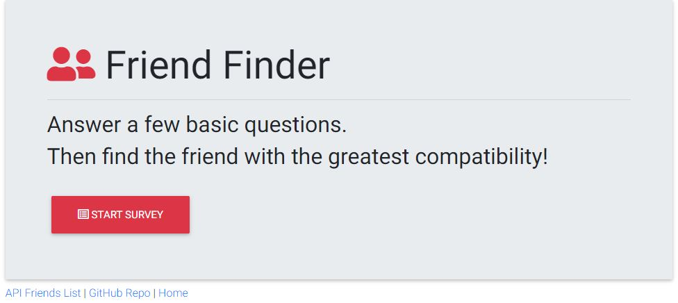

# FriendFinder (Node and Express Servers)

Friendfinder is a full stack compatibility-based application thats takes in results from a user's survery and then compares their answers with those from other users. The app then displays the name and picture of the user with the best overall match. 

This app uses the node express package to serve 2 static HTML files along with their css and js files and also serves 2 API routes to get and post data. Data is stored in current session in an object in friends.js and is reset back to dummy data upon starting a new session.

## Deployment
1. Clone repo and run `npm install` to download app dependencies.
2. Run the app in localhost:8081 in your browser. ("http://localhost:8081")

## Screen Shots
Home/Index Page

Survey Page

Results Modal

API List

## Technology/Dependencies 
* JavaScript: https://www.javascript.com/
* Node.js: https://nodejs.org/en/
* Express: https://www.npmjs.com/package/express
* Path: https://www.npmjs.com/package/path
* Material Design for Bootstrap (Add CDN in HTML): https://mdbootstrap.com/docs/jquery/
* Pretty Checkbox (Add CDN in HTML): https://lokesh-coder.github.io/pretty-checkbox/

